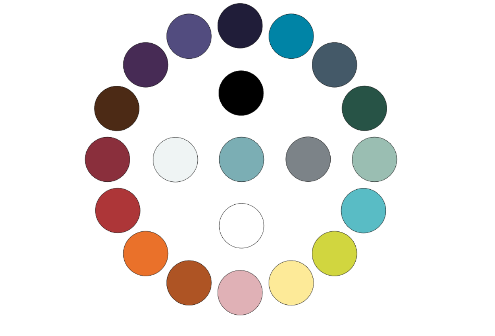
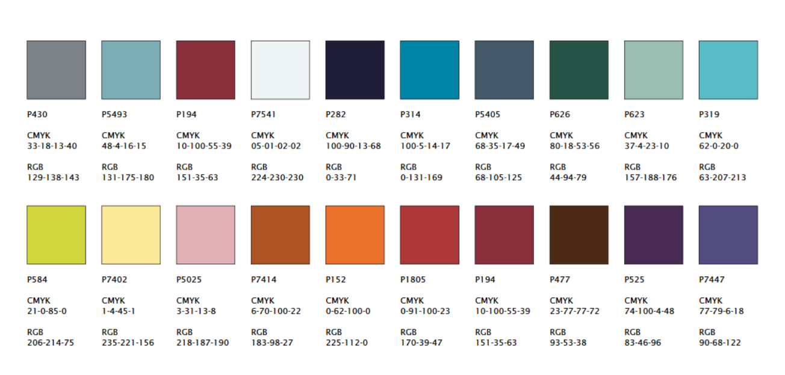

# eaaaR: EAAA color schemes for ggplot and RMarkdown

## Installation

Install [R (3.5.x or later)](https://mirrors.dotsrc.org/cran/) and [RStudio](https://www.rstudio.com/products/rstudio/download/#download). Windows users should also install [RTools](https://mirrors.dotsrc.org/cran/bin/windows/Rtools/). 

Then open RStudio (if running windows as administrator!) and run:

```{r}
devtools::install_github("aaronsaunders/eaaaR")
```


## EAAA colored theme for ggplot2

Based on code from https://drsimonj.svbtle.com/creating-corporate-colour-palettes-for-ggplot2

Load the required libraries.

```{r}
library(eaaaR)
library(ggplot2)

theme_set(theme_minimal())
```

The `eaaa_cols()` function returns colors designated in the [EAAA corporate design manual](https://update.eaaa.dk/afdeling/kommunikation/brevskabeloner-og-logo/Sider/design.aspx).





Most commonly the user will just call one of the scales `scale_*_eaaa()`

```{r}
# Color by discrete variable using default palette
ggplot(iris, aes(Sepal.Width, Sepal.Length, color = Species)) +
  geom_point(size = 4) +
  scale_color_eaaa()
```
```{r}
# Color by numeric variable with cool palette
ggplot(iris, aes(Sepal.Width, Sepal.Length, color = Sepal.Length)) +
  geom_point(size = 4, alpha = .6) +
  scale_color_eaaa(discrete = FALSE, palette = "cool")
```

```{r}
# Fill by discrete variable with different palette + remove legend (guide)
ggplot(mpg, aes(manufacturer, fill = manufacturer)) +
  geom_bar() +
  theme(axis.text.x = element_text(angle = 45, hjust = 1)) +
  scale_fill_eaaa(palette = "mixed", guide = "none")
```

You can get access to the colors directly by calling `eaaa_cols()`

```{r}
eaaa_cols()
```


```{r}
ggplot(mtcars, aes(hp, mpg)) +
  geom_point(color = eaaa_cols("red"),
             size = 4, alpha = .8)
```


## EAAA report templates in RMarkdown

http://freerangestats.info/blog/2017/09/09/rmarkdown

https://rstudio.github.io/rstudio-extensions/rmarkdown_templates.html#overview
