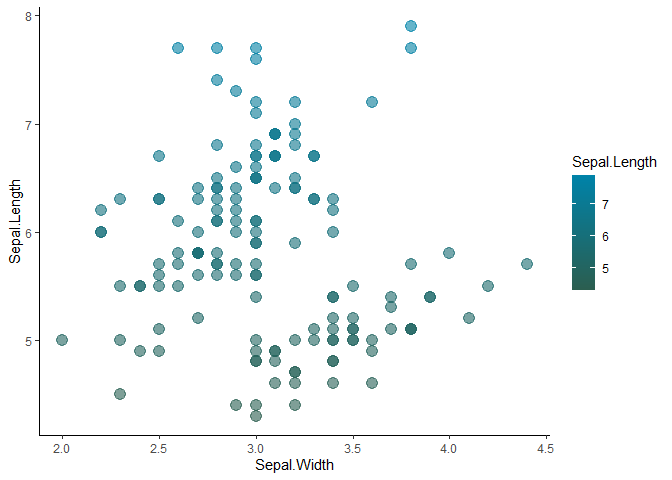

# eaaaR: EAAA color schemes for ggplot and RMarkdown

## Installation

Install [R (3.5.x or later)](https://mirrors.dotsrc.org/cran/) and
[RStudio](https://www.rstudio.com/products/rstudio/download/#download).
Windows users should also install
[RTools](https://mirrors.dotsrc.org/cran/bin/windows/Rtools/).

Then open RStudio (if running windows as administrator\!) and run:

``` r
devtools::install_github("aaronsaunders/eaaaR")
```

    ## Skipping install of 'eaaaR' from a github remote, the SHA1 (1ffe1dbd) has not changed since last install.
    ##   Use `force = TRUE` to force installation

## EAAA colored theme for ggplot2

Based on code from
<https://drsimonj.svbtle.com/creating-corporate-colour-palettes-for-ggplot2>

Load the required libraries.

``` r
library(ggplot2)
```

    ## Warning: package 'ggplot2' was built under R version 3.6.3

``` r
library(eaaaR)

theme_set(theme_classic())
```

The `eaaa_cols()` function returns colors designated in the [EAAA
corporate design
manual](https://update.eaaa.dk/afdeling/kommunikation/brevskabeloner-og-logo/Sider/design.aspx).

 

Most commonly the user will just call one of the scales `scale_*_eaaa()`

``` r
# Color by discrete variable using default palette
ggplot(iris, aes(Sepal.Width, Sepal.Length, color = Species)) +
  geom_point(size = 4) +
  scale_color_eaaa()
```

<!-- -->

``` r
# Color by numeric variable with cool palette
ggplot(iris, aes(Sepal.Width, Sepal.Length, color = Sepal.Length)) +
  geom_point(size = 4, alpha = .6) +
  scale_color_eaaa(discrete = FALSE, palette = "cool")
```

<!-- -->

``` r
# Fill by discrete variable with different palette + remove legend (guide)
ggplot(iris[runif(n = 15, min = 1, max = 150), ], aes(Species, fill = Species)) +
  geom_bar() +
  theme(axis.text.x = element_text(angle = 45, hjust = 1)) +
  scale_fill_eaaa(palette = "main", guide = "none")
```

<!-- -->

You can get access to the colors directly by calling `eaaa_cols()`

``` r
eaaa_cols()
```

    ##        pink         red        blue   dark blue light green       green 
    ##   "#DABBBE"   "#AA272F"   "#0083A9"   "#002147"   "#9DBCB0"   "#2C5E4F" 
    ##      yellow      orange      purple dark purple        grey   dark grey 
    ##   "#EBDD9C"   "#E17000"   "#5A447A"   "#532E60"   "#44697D"   "#818A8F" 
    ## light brown  dark brown       olive  light blue  light grey  light blue 
    ##   "#B7621B"   "#5D3526"   "#CED64B"   "#3FCF15"   "#E0E6E6"   "#83AFB4" 
    ##    dark red 
    ##   "#97233F"

``` r
ggplot(mtcars, aes(hp, mpg)) +
  geom_point(color = eaaa_cols("red"),
             size = 4, alpha = .8)
```

<!-- -->
